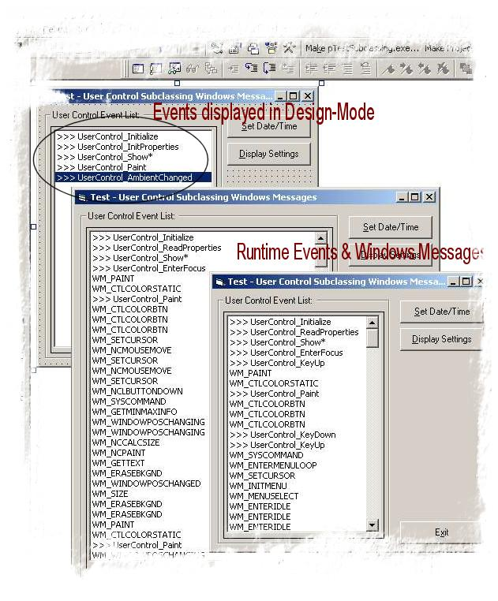



## Subclassing within a UserControl

### Description

This project was put together as a learning tool to better understand how to capture Windows Messages using subclassing within a OCX.

Capuring Windows Messages in a executable is very straight forward - however within an OCX, it's a whole new dimension. This project demonstrates how to overcome the difficulties without using thrid-party products or external DLLs.

Keep your eye on both the Immediate Window and the UserControl's ListBox in both Design-time and run-time whilst resizing, minimising, maximising, moving, clicking, etc to better understand how the UserControl and Windows Messages Work.

I hope that you get the same benefit from using this code as I did coding it!
 
### More Info
 

             |
---                |---
**Submitted On**   |2001-11-09 22:57:26
**By**             |[Slider](https://github.com/Planet-Source-Code/PSCIndex/blob/master/ByAuthor/slider.md)
**Level**          |Intermediate
**User Rating**    |5.0 (50 globes from 10 users)
**Compatibility**  |VB 6\.0
**Category**       |[Custom Controls/ Forms/  Menus](https://github.com/Planet-Source-Code/PSCIndex/blob/master/ByCategory/custom-controls-forms-menus__1-4.md)
**World**          |[Visual Basic](https://github.com/Planet-Source-Code/PSCIndex/blob/master/ByWorld/visual-basic.md)
**Archive File**   |[Subclassin3434311102001\.zip](https://github.com/Planet-Source-Code/slider-subclassing-within-a-usercontrol__1-28789/archive/master.zip)

